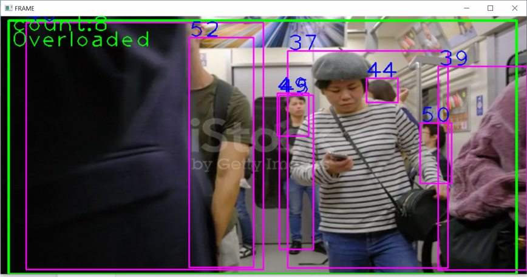
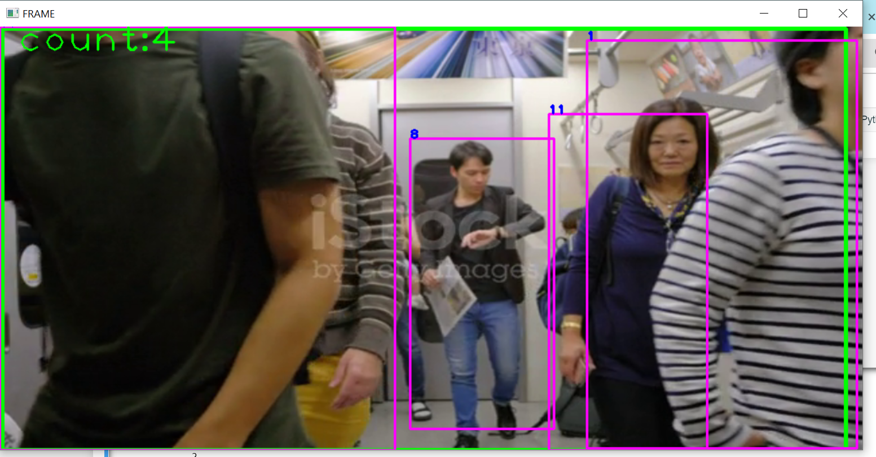
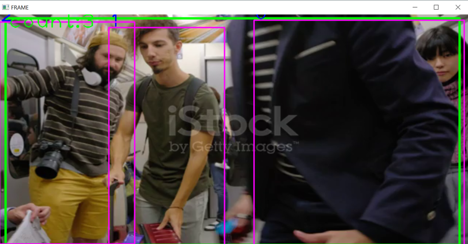
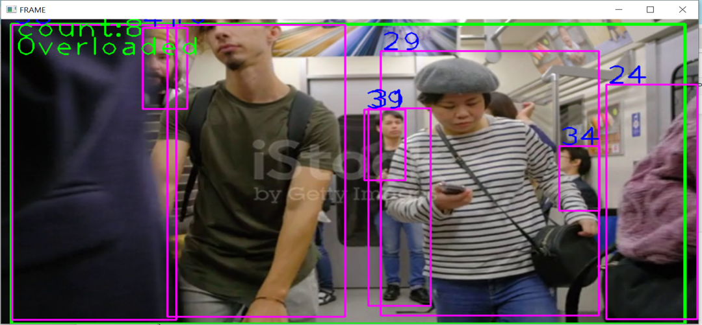

# Object Detection and Tracking

This project implements a real-time object detection and tracking system using deep learning model and OpenCV. The primary focus is on detecting people in a video file and tracking their movement within a defined region of interest (ROI).

## Table of Contents
- [Introduction](#introduction)
- [Features](#features)
- [Requirements](#requirements)
- [Installation](#installation)
- [Usage](#usage)
- [Code Explanation](#code-explanation)
- [Output](#output)

## Introduction

This project utilizes a pre-trained object detection model to identify and track people in a video stream. The system draws bounding boxes around detected individuals, assigns unique IDs, and counts the number of people present in a specified area. It can be applied in various scenarios, such as monitoring crowded spaces or counting attendees in events.

## Features

- Real-time object detection using different deep learning models such as Faster RCNN, SSD, RetinaNet, YOLO model.
- Tracking of detected individuals with unique IDs.
- Visualization of detected objects and their IDs on the video feed.
- Counting of individuals within a defined region of interest (ROI).
- Display of warnings when the count exceeds a specified threshold.

## Requirements

To run this project, ensure you have the following packages installed:

- Python 3.x
- OpenCV
- PyTorch
- NumPy

You can install the required packages using pip:

```bash
pip install opencv-python torch torchvision numpy
```

## Usage
- Clone the repository.
- Prepare your video: Ensure you have a video file for detection. Update the path in the code where it reads the video:
```bash
cap = cv2.VideoCapture('path_to_your_video.mp4')
```
- Run the script: Execute the script in your Python environment.
- View results: The program will open a window showing the video with detected objects and their tracking IDs, along with a warning if the count exceeds a specified limit.

## How It Works
The script loads a pre-trained such as Faster R-CNN model from TorchVision.
It captures frames from the specified video file.
The model detects objects in each frame, and the Tracker class assigns unique IDs to the detected objects.
The detected objects are tracked based on the proximity of their center points, and the tracking information is displayed on the video frames.
### Key Components
- Model Initialization: The model is initialized using fasterrcnn_resnet50_fpn with pre-trained weights.
- Object Detection: The model processes video frames to detect objects.
- Tracking: The Tracker class keeps track of detected objects by calculating the center points of their bounding boxes.
## Code Explanation 
### Tracker Class
The Tracker class is responsible for tracking detected person objects based on the proximity between their center points. It maintains a dictionary of center points and assigns unique IDs to each detected individual.
- Initialization:
  center_points: Stores the center coordinates of tracked objects.
  id_count: A counter for generating unique IDs.
- Update Method:
  Takes a list of bounding boxes, calculates their center points, and updates or assigns IDs based on proximity.

### Object Detection and Tracking Loop
- Region of Interest: Defined as a polygon to focus tracking efforts.
- Video Processing: Continuously reads frames, performs object detection, and updates the tracker.
- Counting: Maintains a count of detected individuals within the ROI and displays results in the video feed.

## Output
### Output

In this project, we implemented four object detection models: **Faster R-CNN**, **SSD (Single Shot MultiBox Detector)**, **RetinaNet**, and **YOLO (You Only Look Once)**. Each model was evaluated on the same input images, and the following outputs were generated:

#### 1. Faster R-CNN
Faster R-CNN is known for its accuracy and is one of the most widely used models for object detection. Below is the output image generated using the Faster R-CNN model:



*The Faster R-CNN model effectively detected various objects with precise bounding boxes, showcasing its robust performance in complex scenes.*

---

#### 2. SSD (Single Shot MultiBox Detector)
SSD is designed for real-time object detection and is known for its balance between speed and accuracy. The output from the SSD model is shown below:



*The SSD model demonstrates impressive speed while maintaining a good level of accuracy, making it suitable for applications requiring quick inference times.*

---

#### 3. RetinaNet
RetinaNet employs a unique focal loss function to address the class imbalance during training, which enhances its ability to detect small objects. Here is the output image generated from the RetinaNet model:



*The RetinaNet model showcases its capability to detect objects with varying sizes, particularly small objects, thanks to its advanced loss function.*

---

#### 4. YOLO (You Only Look Once)
YOLO is renowned for its high speed and efficiency, processing images in real-time. Below is the output image produced by the YOLO model:



*The YOLO model provides fast and accurate detections, making it highly effective for applications where speed is critical, such as video analysis and autonomous driving.*

---

### Summary of Results
Each model has its strengths and weaknesses, as illustrated by their outputs. The choice of model depends on the specific requirements of the application, such as the need for speed versus the need for accuracy. The following table summarizes the performance characteristics of each model:

| Model         | Speed           | Accuracy      | Notes                                          |
|---------------|------------------|---------------|------------------------------------------------|
| Faster R-CNN  | Moderate        | High          | Best for accuracy-focused applications         |
| SSD           | Fast             | Moderate      | Balances speed and accuracy                    |
| RetinaNet     | Moderate         | High          | Effective for detecting small objects          |
| YOLO          | Very Fast        | Moderate      | Excellent for real-time applications           |

